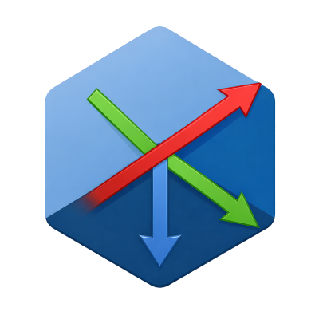

# 🚀 AXIS Language



> **"Só fiz por diversão, não é pra ser nada grande nem profissional"**

A **AXIS** é uma linguagem de baixo nível criada para quem quer sentir o **poder total** sobre a memória. Chega de abstrações chatas, aqui é você e os ponteiros!

## 🚀 Como Rodar a AXIS

Siga os passos abaixo para compilar o interpretador e rodar seu primeiro código:

2. **Criando seu Script** Crie um arquivo .axis (ex: teste.axis):
  ## 💻 Exemplo de Código:
    $ Fazendo a AXIS brilhar
    NOMEAR 0 MEU_NUMERO
    IR MEU_NUMERO
    ENTRADA    $ Aqui você assume o controle
    MAIS       $ Soma 1
    VALOR      $ Mostra o resultado final

3. **Executar** Abra o terminal e digite:
   ```bash
   gcc interpretador.c motor.c -o axis
   
4. **Abrir o arquivo** digite:
   ```bash
   ./axis nome_do_arquivo.axis

PARA ACESSAR OS COMANDOS ACESSE A DOCUMENTAÇÃO OFICIAL.

https://hatsunemikutoro-hash.github.io/AXIS-DOCUMENTATION/

atualmente eu não sei o poder total dessa linguagem, se você conseguir fazer algo legal, ou tiver sugestões por favor me contate!!
